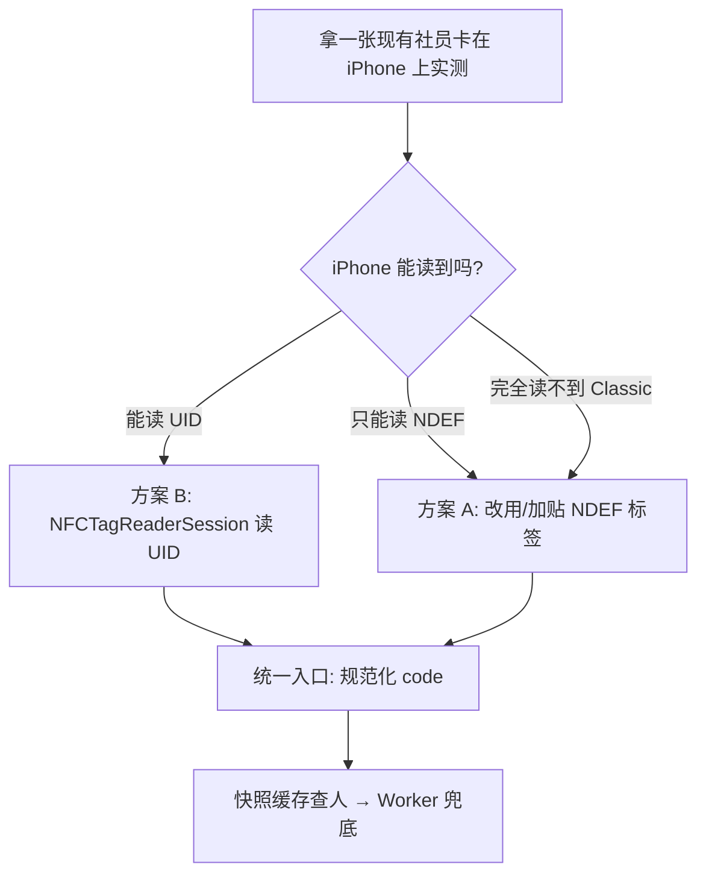
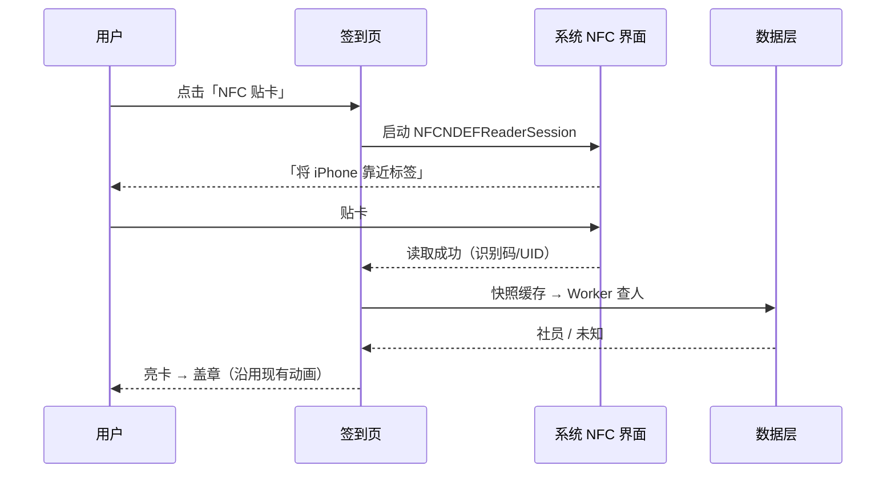

# DeepMei iOS NFC 功能设计书

> 日期：2026-08-09
> 适用仓库：`/Users/shensunfeng/DeepMei`（iOS 版）
> 参考实现：Android 版 NFC（Reader Mode / NfcEventManager / 全局亮卡 / 签到 / 社员查询 / WebView 注入）
> 原则：功能对齐 Android，交互遵循 Apple HIG 与 iOS 26 Liquid Glass 设计语言，不照搬 Android 交互范式。

---

## 1. 背景与目标

让 iPhone 用户获得与 Android 对等的 NFC 体验：

1. 活动签到：贴卡 → 亮社员卡 → 盖章；
2. 社员查询：贴卡 → 直接进社员详情；
3. 全局亮卡：任意场景贴卡 → 悬浮展示社员卡；
4. 离线/秒开：继续复用现有社员快照缓存。

## 2. 平台约束（必须先接受，再谈设计）

| 约束 | 说明 | 设计影响 |
| --- | --- | --- |
| 扫描必须由系统界面呈现 | Core NFC 会弹出系统级「将 iPhone 靠近标签」界面，App 不能自定义取景框/持续监听 | 交互是「点按触发、一次一卡」，不是 Android 的常驻 Reader Mode |
| 不支持 MIFARE Classic | 支持 NDEF、ISO 14443-4（ISO 7816 Applet）、MIFARE Ultralight/Plus/DESFire、ISO 15693、FeliCa | 必须先验证现有实体卡在 iPhone 上的可读性 |
| 免费开发者账号无 NFC | 需要付费 Apple Developer Program + 开启「Near Field Communication Tag Reading」能力 | 工程与上架前置条件（见经验文档第 5 节） |
| 后台读取仅限 NDEF + Universal Link | iPhone XS 及以后、屏幕亮起、NDEF 内含 App 的 Universal Link URL，系统横幅唤起 | 「全局亮卡」无法做成 Android 那种常驻监听，只能提供入口按钮 + 后台链接唤起 |
| watchOS 无第三方 NFC 读卡 | Apple Watch 的 NFC 仅限 Apple Pay | 手表端不做 NFC |
| 需声明用途字符串 | Info.plist 必须加 `NFCReaderUsageDescription`；审核需说明用途 | 文案见 6.3 |

## 3. 卡型与数据策略（核心决策）

Android 读取的是实体卡 UID（十六进制），匹配飞书「社员卡号」字段。iPhone 能否复用同一批卡，取决于卡型：

- 若现有卡为 NTAG21x / MIFARE Ultralight / DESFire / ISO 14443-4 → iPhone 可读，直接对齐 Android；
- 若现有卡为 MIFARE Classic → iPhone 读不了，必须换标签方案。

### 方案 A（推荐，不依赖卡型）

采用 **NDEF 标签贴纸/卡片**（如 NTAG213），写入社员识别码（如 `SM201809A00100201`）作为 NDEF 文本记录。

- App 读 NDEF → 解析出识别码 → 快照/Worker 查人 → 签到/亮卡；
- 识别码本身唯一，不依赖 UID；
- 写入工具：先用「NFC Tools」等第三方工具批量写卡；本期 App 不做写卡功能（避免误写与审核风险），后续可加管理员写卡模式。

### 方案 B（兼容现有可读卡）

用 `NFCTagReaderSession` 读卡 UID → 大写十六进制 → 走与 Android 相同的「社员卡号」匹配逻辑。

### 决策流程



设计上把两种方案统一成同一个抽象：**一次扫描得到一个规范化 code**（识别码或卡号），后续查人、签到、亮卡流程完全一致。

## 4. 功能范围与 Android 对照

| Android 能力 | iOS 设计 | 差异说明 |
| --- | --- | --- |
| 签到页 NFC 贴卡自动查人 | 签到页「NFC 贴卡」按钮 → 系统扫描 → 查人 → 亮卡/未知卡 | 交互从“常驻等待”改为“点按触发” |
| 社员查询贴卡自动查询 | 搜索栏下「贴卡识别」按钮 → 系统扫描 → 直接进详情 | 同上 |
| 全局 NFC 亮卡（任意页面贴卡） | ① 首页/工作台「NFC 亮卡」按钮；② NDEF Universal Link 后台唤起（XS+） | 无法常驻监听，只能入口化 |
| WebView 注入卡号 | 不做 JS 注入 | 改为 App 内直接查人/亮卡；网页场景用 Universal Link 带参进入 |
| NfcEventManager 事件总线 | 不需要 | Core NFC 会话回调本身就是事件源 |
| 设备可用性检测 | `NFCNDEFReaderSession.readingAvailable` / `NFCTagReaderSession.readingAvailable` | 模拟器/不支持设备自动隐藏入口 |

## 5. 交互设计（结合 HIG）

### 5.1 签到页

现有「待机 → 读取 → 亮卡 → 盖章」四幕保留，NFC 融入待机幕：



要点：

- 主按钮用 SF Symbol `nfc`，与「扫码签到」「手动输入」并列；NFC 作为主入口之一，不替换扫码/手动；
- 系统扫描界面不可自定义，App 只能设置 `alertMessage`（如「将社员卡靠近 iPhone 顶部」）；
- 读取成功后自动收起系统界面，进入现有读取动画；失败/超时由系统提示，App 内 toast 补充；
- 无障碍：按钮加 `accessibilityLabel`，系统扫描界面本身支持 VoiceOver；
- 触觉反馈沿用现有成功/失败反馈，不重复堆叠。

### 5.2 社员查询

- 搜索栏下方提示改为「或点“贴卡识别”，将社员卡靠近 iPhone」+ 「贴卡识别」按钮；
- 读取成功后直接进详情（识别码/卡号唯一，与 Android 行为一致）；
- 搜索框、候选列表、详情页逻辑不变。

### 5.3 全局亮卡（替代设计）

两个入口：

1. **入口按钮**：首页工具栏或工作台增加「NFC 亮卡」；点击 → 系统扫描 → 成功后以液态玻璃悬浮卡展示（复用 `MemberCardFace`，遮罩用 iOS 26 `glassEffect` / `.ultraThinMaterial`，点卡片外关闭）；
2. **后台读取（增强）**：若标签写入含 Universal Link 的 NDEF URL（如 `https://szzxshumei.com/nfc/<code>`），在支持的设备上贴卡时系统横幅唤起 App，App 解析 URL 中的 code 直接亮卡/签到。需要配置 Associated Domains。

遵循 iOS 26 设计语言：悬浮卡使用毛玻璃/液态玻璃，而不是 Android 的纯色遮罩；动画保持轻量（淡入淡出 + 轻微缩放）。

### 5.4 明确不做的事

- 不做 Android 式「持续贴卡监听」（系统不允许）；
- 不做自定义扫描取景框（系统界面不可替换）；
- 不做 WebView JS 注入；
- 不做手表 NFC；
- 本期不做写卡（管理员写卡可后续单独设计）。

## 6. 技术设计

### 6.1 新增文件

`DeepMei/NFC/NFCService.swift`：

- `static var isReadingAvailable: Bool`
- `func readCode() async throws -> NFCReadResult`：NDEF 优先（文本/URL 记录 → 提取识别码）；无 NDEF 时回退读取 tag identifier（UID hex）
- 解析规则与现有 `CheckInService.normalize` 对齐：去横线、大写、去冒号
- Swift 6 并发：delegate 回调是 `nonisolated`，用 `CheckedContinuation` + `Task { @MainActor }` 桥接（沿用 `AppLocationService` 的续体模式）

### 6.2 数据流

```text
扫描结果（识别码 / UID）
    ↓ normalize
MemberSnapshotCache.findCheckInMember   ← 秒开/离线
    ↓ 未命中
CheckInService.lookupMember             ← Worker：nfc.raspjam.com
    ↓ 在线命中
后台刷新快照
    ↓
亮卡 / 未知卡 / 签到提交（与现有流程共用）
```

后端无需改动：与 Android 共用同一 Worker 和飞书表。

### 6.3 工程配置

- Xcode → Signing & Capabilities → 添加 **Near Field Communication Tag Reading**：
  - 本方案（只读 UID）：entitlement `com.apple.developer.nfc.readersession.formats = [TAG]`；
  - 注意：旧资料里的 `NDEF` 值已被 App Store Connect 校验弃用，
    上传会报 `NDEF is disallowed`（ITMS-90778），读原生标签一律用 `TAG`；
  - 若后续要读 ISO 7816 Applet，再按需声明 AID；
- Info.plist 增加：
  ```xml
  <key>NFCReaderUsageDescription</key>
  <string>用于活动签到与社员身份识别时读取树莓社 NFC 社员卡</string>
  ```
- 若做后台读取：Associated Domains（`applinks:szzxshumei.com`）+ Universal Link 处理；
- 需要付费 Apple Developer Program 账号（免费账号无法启用该能力）。

### 6.4 兼容性

- 真机 iPhone 7 及以上可读 NDEF；模拟器不支持，按 `readingAvailable` 隐藏入口；
- 后台读取仅 iPhone XS/XS Max/XR 及以上、屏幕亮起、NDEF 含 Universal Link；
- 深色模式、动态字体跟随现有主题体系。

### 6.5 测试计划

- 真机矩阵：至少覆盖一台支持后台读取的机型（XS+）和一台旧机型（如 8）；
- 标签矩阵：NDEF 文本、NDEF URL、纯 UID 卡、MIFARE Classic（验证预期失败提示）；
- 场景：签到成功/未知卡/超时/连续签到、社员查询、全局亮卡、后台横幅唤起、飞行模式（快照离线命中）；
- 回归：扫码签到、手动输入、登录、社员查询搜索不受影响；
- 隐私政策补充 NFC 数据说明后与 Android 同步。

## 7. 里程碑

| 阶段 | 内容 | 预估 |
| --- | --- | --- |
| M0 验证 | 现有卡在 iPhone 上的可读性实测，决定方案 A/B；采购/准备 NDEF 标签 | 1–2 天 |
| M1 核心 | NFCService + 签到页接入 + 工程配置 | 2–3 天 |
| M2 扩展 | 社员查询贴卡识别 + 全局亮卡入口 | 1–2 天 |
| M3 增强/上架 | 后台 Universal Link、隐私政策更新、审核材料 | 1–2 天 |

## 8. 风险与对策

| 风险 | 对策 |
| --- | --- |
| 现有卡为 MIFARE Classic，iPhone 完全读不了 | 方案 A：改用/加贴 NDEF 标签，成本低、可批量写卡 |
| 免费开发者账号无法启用 NFC | 升级付费账号；否则保持扫码/手动方案 |
| App Store 审核拒绝 NFC 用途 | `NFCReaderUsageDescription` 写清“读取树莓社自己的社员卡”，不涉及支付/身份受限 AID |
| 后台读取仅限部分机型 | 作为增强能力，按钮入口覆盖所有支持机型 |
| 用户误以为可以“一直贴着等” | 交互文案明确“点按后靠近”，符合系统 NFC 心智模型 |

## 9. 参考

- Android 实现：`MainActivity.kt`（Reader Mode）、`NfcEventManager.kt`、`GlobalMemberCardOverlay.kt`、`CheckInScreen.kt`、`MyRaspberryScreen.kt`、`WebViewScreen.kt`
- Apple：Core NFC、`NFCNDEFReaderSession`、`NFCTagReaderSession`、HIG Near Field Communication
- 本仓库：[iOS-SwiftUI-经验教训.md](./iOS-SwiftUI-经验教训.md) 第 5 节（免费账号无 NFC 能力）
